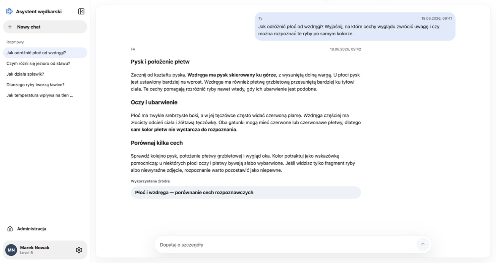
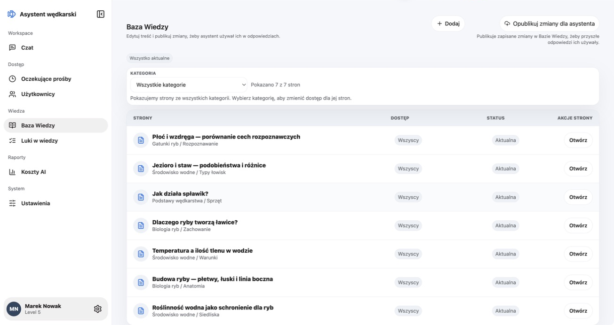
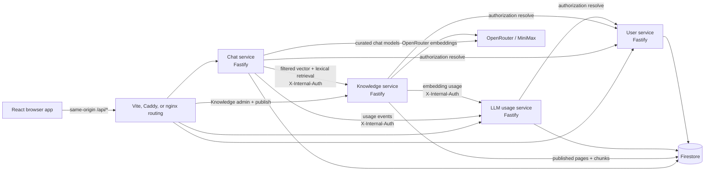

# Fishing Assistant

Fishing Assistant is an authenticated reference application for maintaining a
controlled fishing knowledge base and answering questions from that material.
It is intended for engineers evaluating a React and Fastify retrieval-augmented
generation (RAG) application, and for operators who want to run it with their
own GCP, Auth0, OpenRouter, and MiniMax accounts.

Approved users can keep per-user conversation histories, stream answers, and
open citations when a Knowledge Base page has a source link. Administrators can
write Markdown pages, organize them by category and section, control which
access tiers may retrieve them, publish or reindex saved content, approve
users, review knowledge gaps, select a curated chat model, and inspect token and
cost records. Retrieval combines Firestore vector search with lexical scoring
and filters evidence by the signed-in user's access before it reaches the chat
model.

This repository is a technical showcase, not a hosted public demo or an
included fishing encyclopedia. Running the full product requires accounts,
credentials, provider billing or credits, and initial cloud configuration.
Operators are responsible for the rights to Knowledge Base material they add
and for charges from their GCP and model-provider accounts.

## Application screenshots

These captures show the application interface with example data substituted in
the browser: a fictional profile, conversation history and knowledge titles,
and an illustrative answer based on general knowledge. No Knowledge Base data
was changed. The screenshots illustrate the UI; they are not evidence of a
retrieval run, measured performance or guaranteed model answers.

### Chat with sources



An illustrative answer with a source label matching a page in the example knowledge list.

### Knowledge administration



Category filtering, per-page access and publication status in the knowledge list.

The [browser acceptance report](docs/operations/dev-streaming-acceptance-2026-09-15.md)
records the observed streaming, history and usage checks for the tested DEV release.

## Guided demo

This demo is a reproducible walkthrough using fictional data written for this
repository. It describes expected behavior from the implementation; it is not
a captured live run, and the model's exact wording can vary.

1. Complete the [full local setup](docs/getting-started.md#run-the-full-application)
   and sign in as an approved administrator. Switch the interface to English if
   useful.
2. Open **Administration → Knowledge Base**, add a page in any category, choose
   **Everyone approved** access, and use
   `https://github.com/pbuchman/fishing-assistant#guided-demo` as its **Source
   link**. The source link is metadata for citations; the application does not
   import content from that URL.
3. Paste this Markdown into the page editor:

   ```markdown
   # Fictional canal session log

   These test sessions took place on the invented Alder Cut Canal.

   ## Session A

   - Feeder: 30 g cage feeder
   - Hook bait: two grains of sweetcorn
   - Result: six bream

   ## Session B

   - Feeder: 20 g cage feeder
   - Hook bait: two red worms
   - Result: three bream
   ```

4. Select **Create page draft**. A saved draft is not yet available to chat.
   Open the page actions, select **Publish page**, and wait until the page is
   marked **Current** for the assistant.
5. In Chat, ask questions such as:

   - `What feeder weight and hook bait were used in Session A?`
   - `Compare the feeder weight and hook bait in Session B with Session A.`
   - `What was the water temperature during Sessions A and B?`

The first two answers should be grounded in the pasted values and may cite the
source link. The page contains no temperature, so the last answer should state
that the accessible Knowledge Base does not provide it instead of inventing a
value. The model may phrase that response differently. Administrators can then
review the **Answer gaps** queue, labelled **Knowledge gaps** in the current
English UI, for the missing-information record and **Usage** for the related
model and embedding activity.

## Architecture



The browser receives Auth0 tokens and calls only the same-origin API paths from
`apps/web/service-manifest.json`. Backend-to-backend requests use internal HTTP
and `X-Internal-Auth`; provider keys and the internal token stay in backend
processes.

| Service             | Responsibility                                                                                                                                                                                               |
| ------------------- | ------------------------------------------------------------------------------------------------------------------------------------------------------------------------------------------------------------ |
| `chat-service`      | Conversation CRUD, SSE answer streaming, RAG orchestration, citation persistence, chat model settings, and answer-gap capture.                                                                               |
| `knowledge-service` | Markdown page administration, publishing and chunking, OpenRouter embeddings, vector plus lexical retrieval, and page/category access filtering. Only published, current, accessible chunks are retrievable. |
| `llm-usage-service` | Per-request chat and embedding usage events, estimated cost records, aggregates, and admin reporting.                                                                                                        |
| `user-service`      | Auth0 JWT verification, profile bootstrap, signup restrictions, approval and suspension state, access tiers, and admin user management. Other services resolve user authorization through it.                |

Shared packages contain HTTP contracts, Firestore adapters, internal clients,
LLM adapters, pricing logic, and observability helpers. The four services use
Fastify 5; local orchestration uses the workspace's bundled PM2 6.

## Run and verify

For source checks without application credentials:

Use Node.js `>=22.12.0` and pnpm `10.29.3`:

Run the full gate on Linux with `flock` (from `util-linux`) available. The gate
includes deployment-script tests that exercise Linux file locking.

```bash
pnpm install --frozen-lockfile
pnpm run ci
```

Dependency installation needs network access to the package registry. These
commands validate the code but do not provide a working runtime or offline
chat.

The full application requires manual GCP, Auth0, and provider setup. Start with
the detailed guide:

- [Getting started](docs/getting-started.md) — prerequisites, configuration,
  first migrations, local startup, troubleshooting, and maintainer commands.
- [Runtime operations](docs/operations/fa-mvp-runbook.md) — existing DEV and
  production deployment procedures.
- [Observability operations](docs/operations/fa-observability-runbook.md) —
  Grafana Cloud Loki, Alloy, and alert-router setup.

Common focused checks are:

```bash
pnpm run verify
pnpm run lint
pnpm run typecheck
pnpm run test
pnpm run build
```

`pnpm run ci:prod` adds shell, Terraform, production build, and production
runtime verification to the normal CI gate. The root package's `pnpm.overrides`
keep audited transitive packages within their existing major versions; in
particular, `js-yaml@4` is pinned to `4.3.2` in place of PM2 6's `4.1.1`
dependency.

## Models and current limits

The checked-in chat catalog contains three runtime choices:

| Provider   | Model                        | Role                                            |
| ---------- | ---------------------------- | ----------------------------------------------- |
| OpenRouter | `deepseek/deepseek-v4-flash` | Default chat model, shown as DeepSeek V4 Flash. |
| OpenRouter | `minimax/minimax-m3`         | Curated MiniMax M3 route through OpenRouter.    |
| MiniMax    | `MiniMax-M3`                 | Curated direct MiniMax route.                   |

Embeddings use OpenRouter model `qwen/qwen3-embedding-8b` with 2,048
dimensions. That dimension is coupled to the Firestore vector indexes and
stored chunks; changing it requires matching index changes and a complete
Knowledge Base reindex.

The UI offers Polish (`pl`) and English (`en`) and defaults to Polish. Some
product copy remains untranslated, and the chat language follows the user's
question rather than the UI selection.

Knowledge content is entered as Markdown. There is no URL or PDF importer,
web-browsing tool, arbitrary model entry, or offline chat mode. Answers depend
on the pages an administrator has published, the user's access, Firestore
availability, and external model providers. This repository makes no benchmark
or exact-answer guarantee.

## License

Fishing Assistant is licensed under the [MIT License](LICENSE). Third-party
software keeps its own license terms; selected packages and notable notices are
documented in [THIRD_PARTY_NOTICES.md](THIRD_PARTY_NOTICES.md).
